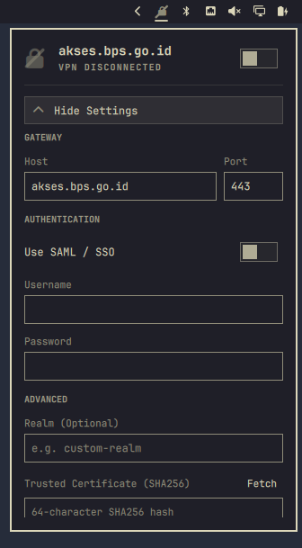

# OpenFortiVPN

An [Omarchy](https://omarchy.org/) shell bar widget: a VPN icon that shows the current connection status and uptime, with a click-to-open popup for configuring connection details, toggling SAML login, and saving credentials. (Only works for Omarchy Quattro).

Matches the look of the built-in wifi/sound icons only in the bar, no inline text.



## How it works

- `omarchy-openfortivpn-config` reads and writes connection settings to `~/.config/openfortivpn/config`. It supports standard username/password and SAML authentication (via `openfortivpn-webview`). Changing configuration automatically disconnects an active VPN session.
- `omarchy-openfortivpn-up` handles the connection logic. For SAML, it pops up a browser window, retrieves the `SVPNCOOKIE`, and feeds it into the VPN client. For password login, it utilizes `systemctl --user` to ensure background auto-connection across reboots. Multi-monitor double-launches are prevented using `flock`.
- `omarchy-openfortivpn-down` safely disables the active connection, systemd services, and SAML autostart mechanisms.
- `omarchy-openfortivpn-status` monitors the VPN state and uptime to reflect accurately on the widget.
- `Panel.qml` renders the bar icon, `ConfigPanel.qml` manages the settings popup UI, and `Service.qml` handles state management and SAML autostart hooks for Wayland/Hyprland.

## Installation

```bash
omarchy plugin add https://github.com/setiapam/omarchy-openfortivpn.git --enable
```

Ensure `openfortivpn` is installed on your system:
```bash
omarchy-pkg-add openfortivpn
```

### Optional: 1-Click Passwordless Connection & Systemd Autostart
By default, connecting to the VPN prompts for authorization (via Polkit / `pkexec`). If you want seamless 1-click connection from the bar widget without password prompts, run the optional setup script:

```bash
~/.config/omarchy/plugins/murphi.openfortivpn/bin/omarchy-install-service-openfortivpn
```

### Optional: SAML / SSO Support
If your FortiGate VPN gateway requires SAML / SSO authentication (e.g. Microsoft Azure AD, Okta), install `openfortivpn-webview` from the AUR:

```bash
omarchy-pkg-add openfortivpn-webview-bin
# or: yay -S openfortivpn-webview-bin
```

## Configuration

Settings are managed via the UI popup, but you can manually edit `~/.config/openfortivpn/config`:

```ini
# VPN Gateway
host = vpn.example.com
port = 443
realm = developer

# For password auth:
username = your_username
password = your_password

# For SAML/SSO auth:
saml = true
```

## Usage

- **Left-click** — Toggle VPN connection (Connect/Disconnect)
- **Right-click** — Open settings popup to edit config or view details

*Note: When using Password auth with the optional service installed, the VPN will automatically run as a user-level systemd service and persist across reboots. When using SAML, it will automatically popup the login browser upon your next GUI login.*

## Uninstall

```bash
omarchy plugin remove murphi.openfortivpn
```
If you ran the optional setup script earlier, you can also remove the service and sudoers rule:
```bash
~/.config/omarchy/plugins/murphi.openfortivpn/bin/omarchy-remove-service-openfortivpn
```
Your VPN config at `~/.config/openfortivpn/` is preserved during uninstall.
